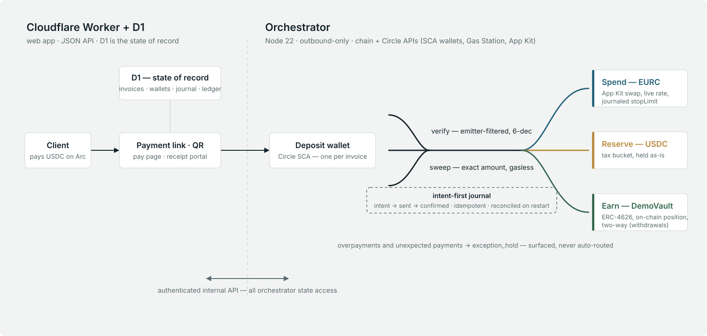

# affluents

**One payment in. Your money routes itself.**

Affluents is a programmable income router on [Arc](https://docs.arc.io), Circle's
stablecoin-native L1. A freelancer shares a payment link; the client pays USDC on
Arc; the verified payment executes the freelancer's allocation policy on the spot —
Spend converted to EURC at a live rate, Reserve set aside for taxes, Earn deposited
into an on-chain vault position. The invoice is the entry point; the product is that
**the payment itself triggers the recipient's financial policy**.

**Live** · [affluents.money](https://affluents.money)
&nbsp;·&nbsp; **Deck** · [affluents.money/deck](https://affluents.money/deck)
&nbsp;·&nbsp; **Deck PDF** · [affluents.money/deck.pdf](https://affluents.money/deck.pdf)
&nbsp;·&nbsp; **3-min video** · [YouTube](https://www.youtube.com/watch?v=jReiv6Vp6hw)
&nbsp;·&nbsp; **Vault on ArcScan** · [0x2c22…9ee0](https://testnet.arcscan.app/address/0x2c22bf430369aaa2caf83a473a702d3aa2a99ee0)

Built solo for the Encode × Arc "Programmable Money" hackathon (DeFi track).
Everything below runs on Arc testnet with real transactions — 15 invoices,
12 withdrawals, 156 green tests.

## The 60-second story

- Create an invoice from your phone — the payment link and QR are instant; a
  dedicated deposit wallet is already assigned (one wallet = one invoice, never reused).
- The client pays USDC on Arc. No gas token needed — the ~$0.01 fee is paid in the
  same USDC. Settlement is sub-second.
- The payment is verified on-chain, then the split executes itself:
  Spend is swapped USDC → EURC at the live App Kit rate, Reserve is held in USDC,
  Earn is deposited into the on-chain vault.
- The client gets a tokenized receipt — status timeline and amounts, nothing internal.
- Every movement links to ArcScan, and the books reconcile to the unit.

## Why Arc

- **USDC-as-gas.** The payer needs no separate gas token — the cent-level fee comes
  out of the same USDC they are already sending. That single fact makes the "just pay
  the invoice" story work for non-crypto clients.
- **Sub-second deterministic finality.** One confirmation is final, so verification,
  routing, and the client's receipt timeline all move at conversational speed.
- **Built for Arc, not just on it.** Arc exposes USDC as both an 18-decimal native
  asset and a 6-decimal ERC-20 view of the same balance. All business amounts here
  are branded 6-decimal types (`Usdc6`/`Eurc6`) with one explicit, tested 18→6
  boundary ([shared/src/amounts.ts](shared/src/amounts.ts)) — and the payment
  verifier filters Transfer logs **by emitter**, so Arc's 18-decimal EIP-7708 system
  logs can never be miscounted as 6-decimal amounts
  ([orchestrator/src/verifier.ts](orchestrator/src/verifier.ts)).

## Circle stack — infrastructure, not name-drops

| Tool | What it does here | Where |
|---|---|---|
| **Circle Dev-Controlled Wallets (SCA)** | The entire wallet layer: per-invoice deposit pool, treasury/spend/reserve/vault roles | [orchestrator/src/circle.ts](orchestrator/src/circle.ts), [orchestrator/src/circleTx.ts](orchestrator/src/circleTx.ts) |
| **Circle Gas Station** | Sponsors every sweep, transfer, and vault deposit — no wallet holds gas, no ops buffers | [orchestrator/src/executor.ts](orchestrator/src/executor.ts) |
| **Arc App Kit** | Live USDC → EURC swaps with a journaled slippage ladder and oracle guard | [orchestrator/src/appKitFx.ts](orchestrator/src/appKitFx.ts), [orchestrator/src/fx.ts](orchestrator/src/fx.ts) |
| **USDC + EURC on Arc** | Pay in USDC, hold Spend in EURC — multi-currency by default | [shared/src/amounts.ts](shared/src/amounts.ts) |

## Architecture



- **Worker + D1** ([worker/](worker/)) — Cloudflare Worker serving the web app
  (landing, invoice creation, payment page, receipts, dashboard, the deck) and a
  JSON API. D1 is the state of record: invoices, wallets, split rules, executions,
  FX journal, withdrawals. Deposit-wallet claim is atomic (proven by a concurrency
  test, [worker/test/claim-concurrency.mjs](worker/test/claim-concurrency.mjs)).
- **Orchestrator** ([orchestrator/](orchestrator/)) — Node 22 daemon (pm2,
  outbound-only). Watches the chain, verifies payments, runs the split pipeline and
  withdrawals through Circle's APIs. All state access goes through the Worker's
  authenticated internal API — the daemon holds no database.
- **Intent-first journal** — every money movement writes its intent row *before*
  dispatch; on restart the orchestrator reconciles the journal against on-chain
  state before acting. Idempotent per execution id.
- **DemoVault** ([contracts/src/DemoVault.sol](contracts/src/DemoVault.sol)) —
  minimal ERC-4626-style vault holding the Earn position, 6-decimal USDC interface.
- **Adapters with fallbacks** — wallets, FX, and yield each sit behind an adapter
  so the demo survives any third-party outage.

## Honest money engineering

- **Exact conservation, enforced and tested.** `spend + reserve + earn == routed
  amount` in integer 6-decimal units — floor Reserve, floor Earn, Spend takes the
  remainder. Withdrawals conserve the same way: the demo's 0.80 withdrawal moved
  Earn −0.80 / Reserve +0.80 with the vault position −0.80 on-chain, band = 0.
- **Overpayments are held, never auto-routed.** Any excess or unexpected payment
  goes to an `exception_hold` ledger state and is surfaced on the dashboard for
  review. The books currently hold exactly one: 0.50 USDC, flagged since the
  overpayment test.
- **Live FX that halts instead of degrading.** Every swap carries a journaled
  `stopLimit` computed from a fresh quote (50→75→100 bps tolerance ladder); a swap
  that can't clear its tolerance halts and the funds wait, labeled, until it can.
  An ECB reference-rate check guards against a broken pool quote — and the testnet
  pool's real deviation from that reference is openly disclosed, not hidden:
  receipts and the dashboard show the ECB indicative figure next to the pool's
  actual output.
- **Demo Vault disclosure.** The Earn position is our own contract, labeled
  "Demo Vault — on-chain position" everywhere. No invented APY, no fake protocol.
- **Crash-tested, not crash-hopeful.** Three real kill tests are in the progress
  log: a graceful SIGINT mid-transfer resumed cleanly; a SIGKILL mid-vault-deposit
  was adopted on restart from the Circle transaction reference; and a true
  worst-window kill re-dispatched idempotently — one Withdraw event on-chain, ever.

## See it live

- Landing: [affluents.money](https://affluents.money)
- Deck: [affluents.money/deck](https://affluents.money/deck) ·
  [PDF](https://affluents.money/deck.pdf)
- A real client receipt (read-only):
  [invoice 2026-017 · Studio Lumen](https://affluents.money/r/rcp_8db548c1cd348059bfd3246987cfbb34)
- On ArcScan: [the vault](https://testnet.arcscan.app/address/0x2c22bf430369aaa2caf83a473a702d3aa2a99ee0) ·
  [a verified payment](https://testnet.arcscan.app/tx/0x7cbbf3389bf9cf3a46b73eab5264f4a6974951a3483f8e18207a2f2e3d86edfe) ·
  a withdrawal's two hops:
  [vault redemption](https://testnet.arcscan.app/tx/0x38a3088565e82e37e6c965fc00c4e977a6d8eb402120404461a91ff2442e68f3),
  [transfer](https://testnet.arcscan.app/tx/0x02cfff64ba8b93ef8338d33957e5754fbbefa6c1891a21a7e91f3a02325de868)

(No payable invoice is linked here on purpose — the demo books are frozen for
judging, and an unexpected payment would land in `exception_hold`.)

## Repo tour

```
worker/          Cloudflare Worker — pages, JSON API, orchestrator-only internal
                 API (shared secret). D1 state of record; migrations 0001–0005.
orchestrator/    Node 22 daemon — watcher, verifier, split pipeline, FX, withdrawals.
contracts/       Foundry — DemoVault.sol + tests.
shared/          Branded money math (Usdc6/Eurc6/Native18), the single 18→6
                 boundary, split conservation. No floats anywhere.
design/          Brand tokens, screenshots, deck sources, the demo video.
```

Tests: **156 green** across the three TypeScript packages —
`cd worker && npx vitest run` (67) · `cd orchestrator && npx vitest run` (70) ·
`cd shared && npx vitest run` (19) — plus 4 contract tests via
`cd contracts && forge test`.
Key invariants: [CLAUDE.md](CLAUDE.md) · full spec: [SPEC.md](SPEC.md) ·
build log: [PROGRESS.md](PROGRESS.md).

## Roadmap

- Pay from any chain — CCTP into the same deposit-and-route pipeline.
- EURC on withdraw — the existing FX engine, pointed the other way.
- A privacy pass over receipts and the ledger.
- Policy-driven treasuries — the same router, aimed at teams instead of freelancers.
